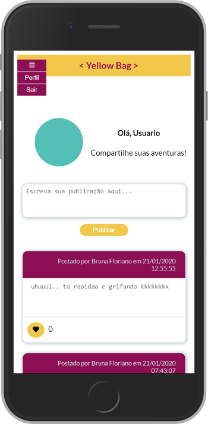
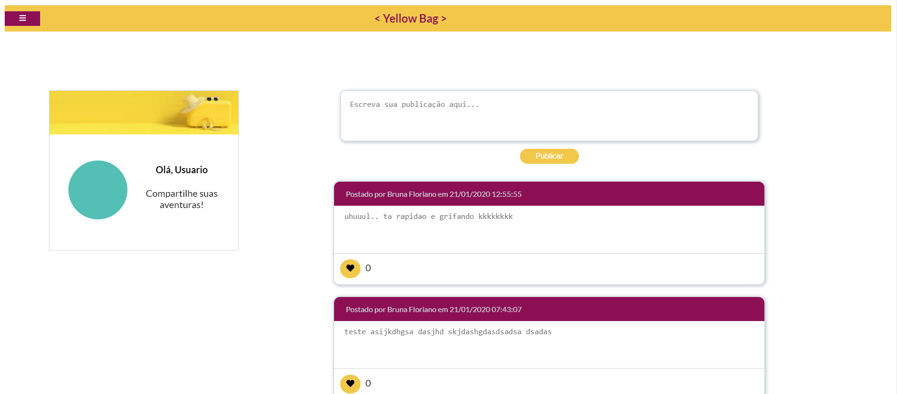

# Social Network

## Índice

* [1. Introdução](#1-introdução)
* [2. Resumo do projeto](#2-resumo-do-projeto)
* [3. Considerações gerais](#3-considerações-gerais)

***

## 1. Introdução

Este projeto faz parte do bootcamp da Laboratoria.

A aplicação consiste na criação de uma Rede Social. Foi desenvolvida em *JavaScript(ES6+)*, juntamente com *HTML5*, *CCS3* e [Firebase](https://firebase.google.com/) Hosting e Firestore para hospedagem e banco de dados.

A página da aplicação pode ser acessada atraves do Link: [Yellow Bag](https://yellow-bag.firebaseapp.com/)

## 2. Resumo do projeto

O objetivo do projeto foi a criação de uma rede social, cuja temática foi deixada à nosso critério.
O tema escolhido para a criação foi "viagens".

As **caraterísticas técnicas** da aplicação são:

* É uma Single-Page Application [SPA](https://dzone.com/articles/how-single-page-web-applications-actually-work) - foi implementado um sistema de rotas (sem uso de bibliotecas externas) para trocar de uma tela para outra de maneira dinâmica (SPA).

* Foi desenhada com enfoque [mobile first](https://darwindigital.com/mobile-first-versus-responsive-web-design/), e apresenta design responsivo

* Permite a persistência de dados - a estrutura de dados foi desenhada de forma à consultá-los, atualizá-los, modificá-los e eliminá-los segundo os requerimentos do usuário. Para isto, foi utilizado `Firestore` do `Firebase`

Foi passado um layout da tela mobile e desktop que deveríamos replicar visualmente e cujo conteúdo, cores e fontes de texto foi deixado à nosso critério.

* Tela mobile

    

* Tela Desktop

    

## Considerações Gerais do Projeto

* Nos foram dadas **histórias de usuário** com os requisitos e funcionalidades que o usuário deseja.

* O projeto foi desenvolvido em equipes de 3 integrantes. A estratégia de desenvolvimento usada para que todos os membros alcançassem os objetivos de aprendizagem foi pair programming e sub-divisão das histórias de usuário.

* Não foi permitido o uso de frameworks de CSS (bootstrap), nem de estilização com `float`.

## Histórias de Usuário

* Como usuário novo, devo poder criar uma conta com email e senha válidos para poder iniciar uma sessão e ingressar na Rede Social.

* Como usuário novo, devo poder ter a opção de iniciar sessão com minha conta do Google ou Facebook para ingressar na Rede Social sem necessidade de criar uma conta de email válido.

* Como usuário logado devo poder criar, guardar, modificar no mesmo lugar (in place) e deletar publicações (post) privadas ou públicas.

* Como usuário logado devo poder ver todos os posts públicos e privados que criei até o momento, do mais recente para o mais antigo, assim como a opção de trocar a configuração de privacidade dos meus posts.

* Eu como usuário logado, posso dar like e ver a contagem de likes em minhas publicações

* Eu como usuário logado, posso escrever, salvar, editar ou deletar um comentário em minhas publicações.

* Ao final devo poder ingressar na Rede Social e poder visualizar os dados de meu perfil criado e editá-los.

## Layout final

Pode-se navegar com usuario teste:

```bash
email: usuario@teste.com
senha: 123123
```

* Tela mobile

    
    

* Tela Desktop

    

## 3. Considerações gerais

* Verifique se tem instalado o [Node.js](https://nodejs.org/) e o [npm](https://docs.npmjs.com/).
* Instale as dependências do projeto rodando o comando `npm install`.
* Para rodar a aplicação no navegador, use o comando `npm start` e para iniciar o servidor web e entre na url `http://localhost:5000`.
